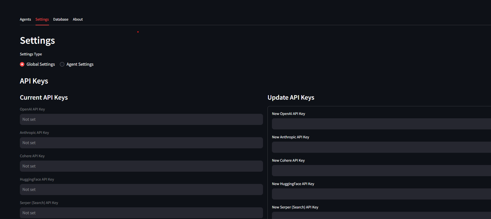
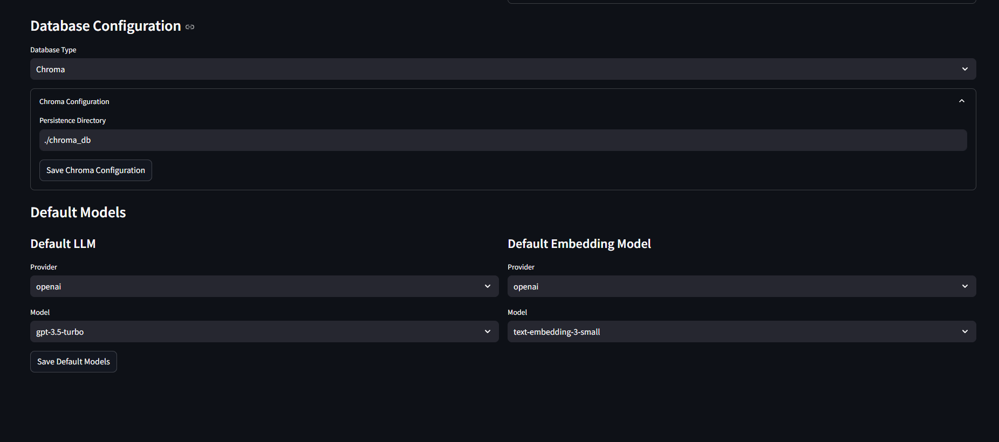

# Agent Forge (Version 1.0.0)

 


## 🌟 Features

- **Multiple LLM Providers**: OpenAI, Anthropic, Cohere, and custom LLM support
- **Advanced Embeddings**: Access embeddings from OpenAI, Cohere, or Hugging Face models
- **Vector Database Integration**: Store and retrieve documents with semantic search using ChromaDB, Pinecone, or Supabase
- **Custom AI Agents**: Create agents with specialized capabilities and personalities
- **No-Code Interface**: Build and configure agents entirely through the UI
- **Environment Management**: Easily manage API keys and configurations

## 🚀 Quick Start

### Option 1: Local Installation

1. **Clone the repository**
   ```bash
   git clone https://github.com/hitankshah/agent-forge.git
   cd agent-forge
   ```

2. **Create environment file**
   ```bash
   cp .env.template .env
   ```
   Then edit `.env` to add your API keys

3. **Install dependencies**
   ```bash
   pip install -r requirements.txt
   ```

4. **Start the application**
   ```bash
   streamlit run start_server.py
   ```
   Access at http://localhost:8501

5. **For settings UI** (optional)
   ```bash
   streamlit run start_server.py -- --settings
   ```

### Option 2: Docker

1. **Using Docker Compose** (recommended)
   ```bash
   docker-compose up -d
   ```
   Access at http://localhost:8501

2. **Using Docker directly**
   ```bash
   docker build -t agent-forge . 
   docker run -p 8501:8501 -v $(pwd)/.env:/app/.env agent-forge
   ```

## 🔧 Configuration

### API Keys

Add your API keys to the `.env` file:
```
OPENAI_API_KEY=your_openai_api_key_here
ANTHROPIC_API_KEY=your_anthropic_api_key_here
COHERE_API_KEY=your_cohere_api_key_here
```

### Database Setup

Agent Forge supports multiple vector databases:

1. **Chroma DB** (default, local)
   - No additional setup required

2. **Pinecone**
   ```
   PINECONE_API_KEY=your_pinecone_api_key_here
   PINECONE_ENVIRONMENT=your_pinecone_environment_here
   PINECONE_INDEX=your_pinecone_index_name_here
   ```

3. **Supabase**
   ```
   SUPABASE_URL=your_supabase_url_here
   SUPABASE_KEY=your_supabase_key_here
   SUPABASE_TABLE=embeddings
   ```
   Note: For Supabase, you need to create a table with pgvector extension.

## 📖 Usage

### Creating an Agent

1. Navigate to the "Agents" tab
2. Fill in the agent name and description
3. Configure advanced settings if needed
4. Click "Create Agent"

### AI-Generated Agents

1. Go to the "Agents" tab
2. Scroll to "AI-Generated Agent"
3. Describe the agent's purpose and capabilities
4. Click "Generate Agent"

### Managing Environment

1. Go to the "Settings" tab
2. Select "Global Settings"
3. Update API keys and configurations

## 🧩 Project Structure

```
agent_forge/
├── core/           # Core agent functionality
├── integrations/   # External API integrations
│   ├── database.py # Database connectors
│   └── embeddings.py # Embedding providers
├── ui/             # User interface components
│   ├── app.py      # Main application UI
│   └── settings_ui.py # Settings interface
└── utils/          # Utility functions
    └── config.py   # Configuration handling
```

## 🛠️ Development

### Requirements

- Python 3.8+
- Required packages in `requirements.txt`

### Local Development

1. Install development dependencies:
   ```bash
   pip install -r requirements-dev.txt
   ```

2. Run tests:
   ```bash
   pytest tests/
   ```

## 📄 License

[MIT License](LICENSE)

## 👥 Contributing

Contributions are welcome! Please feel free to submit a Pull Request.

1. Fork the repository
2. Create your feature branch (`git checkout -b feature/amazing-feature`)
3. Commit your changes (`git commit -m 'Add some amazing feature'`)
4. Push to the branch (`git push origin feature/amazing-feature`)
5. Open a Pull Request
